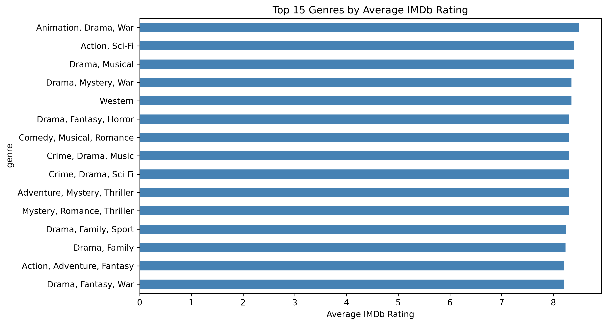
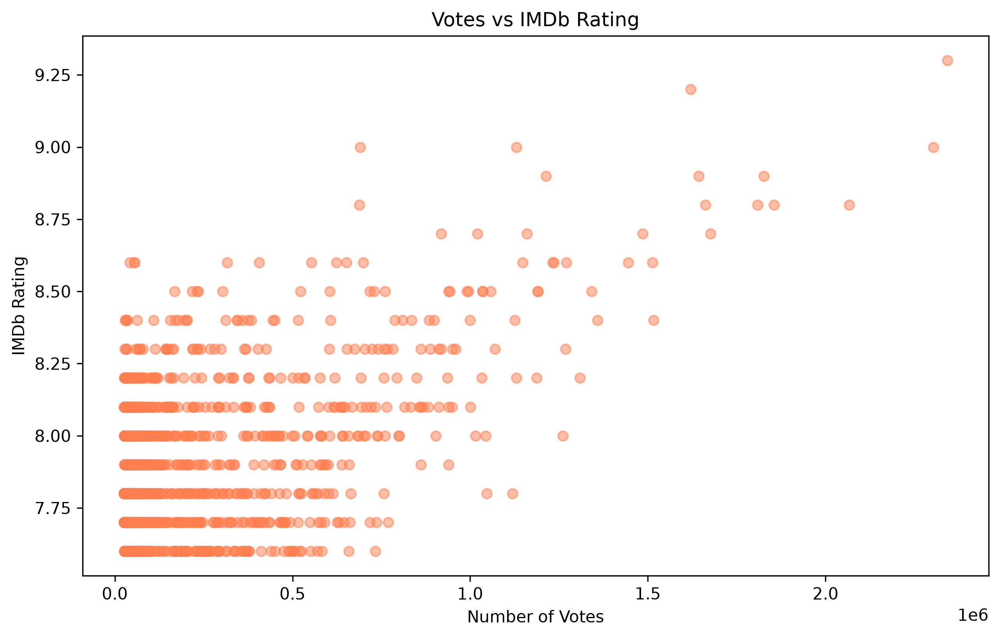
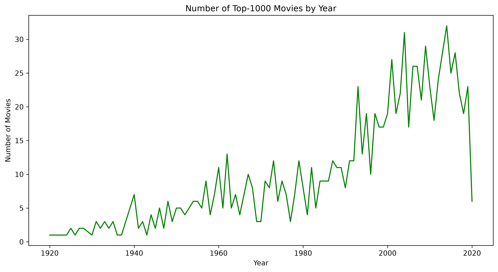
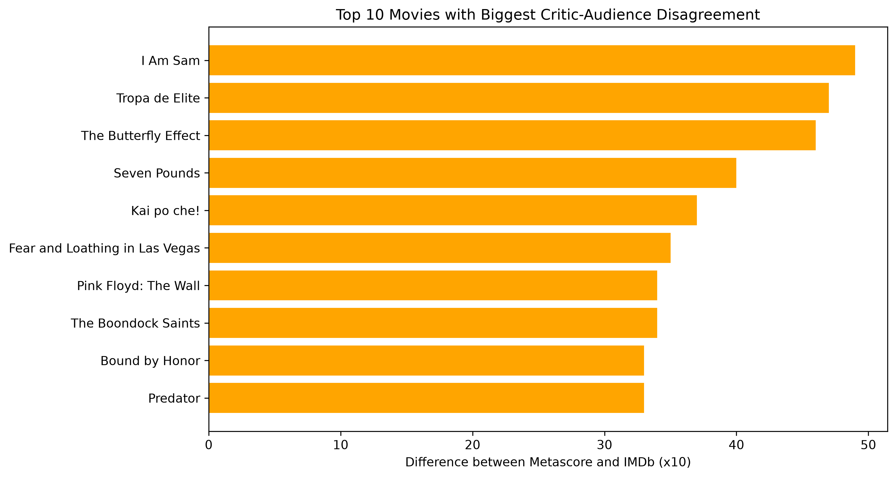
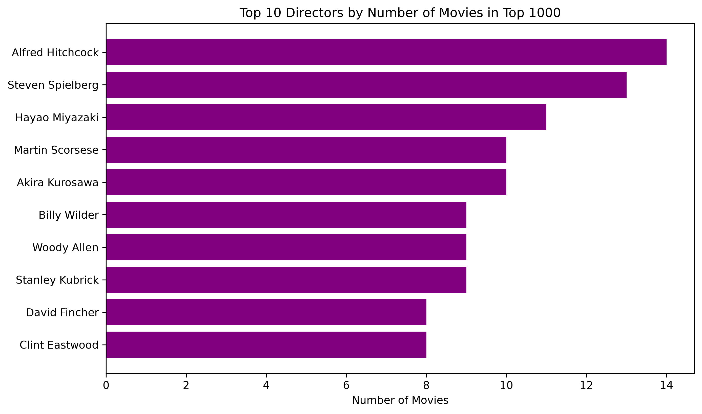

# IMDb Top 1000 Movies Analysis

## About the Project
This is my first data analytics pet project. I explored a dataset of the top 1000 movies according to IMDb ratings.

## Data
The dataset is from Kaggle: [IMDB Top 1000 Movies](https://www.kaggle.com/datasets/harshitshankhdhar/imdb-dataset-of-top-1000-movies-and-tv-shows)

The dataset contains 1000 rows and 16 columns, including:
- Title, release year, genre
- IMDb rating, Metascore, number of votes
- Director, main actors
- Runtime, gross earnings

## Tools
- **PostgreSQL** — database
- **DBeaver** — SQL client
- **Python (pandas, matplotlib, psycopg2)** — for analysis and visualization
- **Jupyter Notebook** — for writing Python code

## Questions I Asked
- How many movies are in the dataset?
- What are the top 10 highest-rated movies?
- Which genres have the highest average rating?
- Which directors have the highest average gross earnings?
- What is the relationship between runtime and IMDb rating?
- Which directors have the most movies in the top 1000?
- Where do critics (Metascore) and viewers (IMDb) disagree the most?

## SQL Queries
All SQL queries are available in the file [`queries.sql`](queries.sql). They include:
1. Total number of movies
2. First 10 rows of the dataset
3. Top 10 movies by IMDb rating
4. Average rating by genre
5. Top 10 directors by average gross earnings
6. Top 20 movies by IMDb rating with runtime
7. Top 10 directors by number of movies in the top 1000
8. Top 10 movies with the biggest difference between Metascore and IMDb rating

## Visualizations

### Top 15 Genres by Average IMDb Rating

### Votes vs IMDb Rating

### Number of Top-1000 Movies by Year

### Top 10 movies with biggest Critic-Audience Disagreement

### Top 10 Directors

## What I Found
- The dataset contains 1000 movies.
- The highest-rated movie is "The Shawshank Redemption" with a rating of 9.3.
- Alfred Hitchcock has the most movies in Top 1000.
- Movies with higher ratings tend to have more votes.
- Most of the top-1000 movies were released between 1990 and 2020.
- "I Am Sam" is a movie with the biggest Critic-Audience disagreement (Metascore 28, IMDb 7.6 ).

## Files
- `queries.sql` — all SQL queries used for the analysis
- `analysis.ipynb` — Jupyter Notebook with Python code
- `imdb_top_1000.csv` — the dataset (optional)
- `*.png` — charts generated with Python

## How to Reproduce
1. Install PostgreSQL and DBeaver.
2. Create a database and table (see `queries.sql`).
3. Import the CSV file into the table.
4. Run the queries from `queries.sql`.
5. Install Python libraries: `pip install -r requirements.txt`
6. Run the Jupyter Notebook `analysis.ipynb`.
